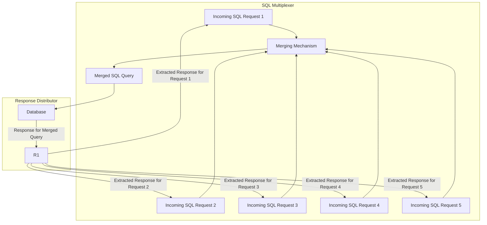

# Multiplex SQL Requests using a Trie

This repository presents a simple implementation that aggregates multiple SQL requests over a time window, inserts them into a trie structure, merges them for optimization, and finally queries the database. By merging and aggregating the requests, we aim to reduce the database I/O and increase the efficiency of query processing.

## How It Works

1. **Collect SQL Requests**: Within the defined time window, all SQL requests are collected without sending them directly to the database.

2. **Insert into Trie**: These collected requests are then inserted into a trie data structure. The trie is organized in a hierarchical manner starting from the SQL action (like SELECT, INSERT, UPDATE), followed by database, table, and columns.

3. **Merge Requests**: Once inserted, the trie can efficiently merge similar requests. For instance, two requests querying different columns from the same table can be merged into a single request querying both columns.

4. **Query Database**: The merged SQL requests are then sent to the database, thus reducing the total number of I/O operations.

## Benefits

- **Reduced I/O**: By consolidating the SQL requests, the number of I/O calls to the database is reduced, which can enhance the database's performance.

- **Optimized Query Execution**: Merged SQL queries can often be executed faster compared to executing multiple similar, individual queries.

- **Scalable**: The approach can easily be scaled to handle a large number of requests, making it suitable for systems with high request rates.

## Usage

Make sure to integrate the provided code logic with your existing database communication layer. Set an appropriate time window based on your application's request frequency and expected response times.

## Real-world Considerations

While the presented code showcases the basic idea of SQL request multiplexing using a trie, a real-world application will have numerous complexities:

- **Throughput:** Depending on the scale of the application, the volume of incoming SQL requests can be massive. Efficient data structures, memory management, and concurrent processing might be essential to handle the high throughput.

- **Complex SQL Queries:** The current example assumes relatively simple SQL statements. In reality, SQL queries can be intricate, involving multiple joins, sub-queries, unions, and complex conditions. Developing a comprehensive merging mechanism for such scenarios can be challenging.

- **Error Handling & Rollbacks:** Ensuring ACID properties and handling errors gracefully is crucial. In case of any failed merged request, a rollback mechanism or a way to re-issue individual queries might be necessary.

- **Database Engine Specifics:** Different databases might have varying optimizations and quirks. Tailoring the multiplexing strategy to fit the specific database engine can lead to better performance.

This project serves as a starting point, and anyone wishing to adapt this for production use-cases should be aware of these considerations and more. 
